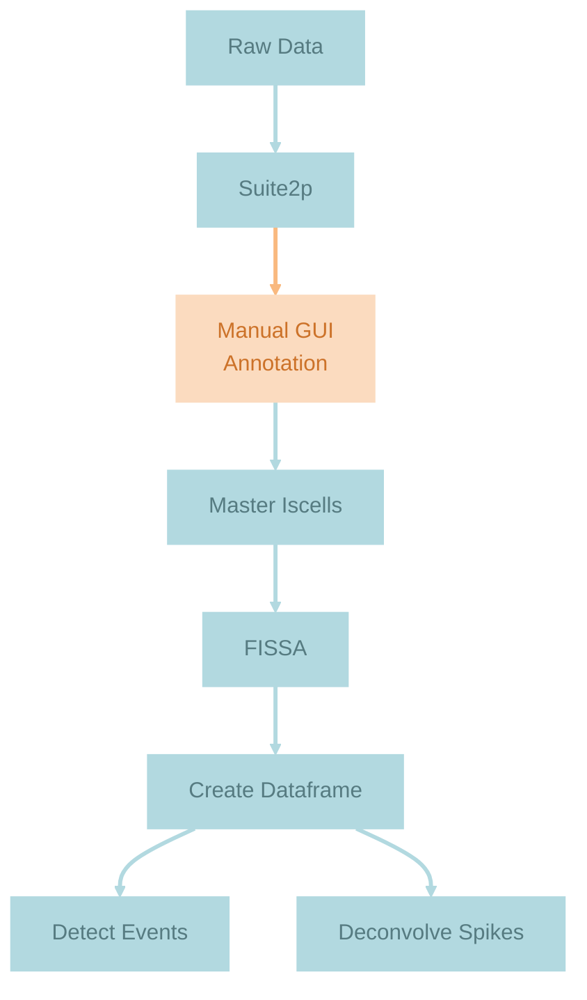
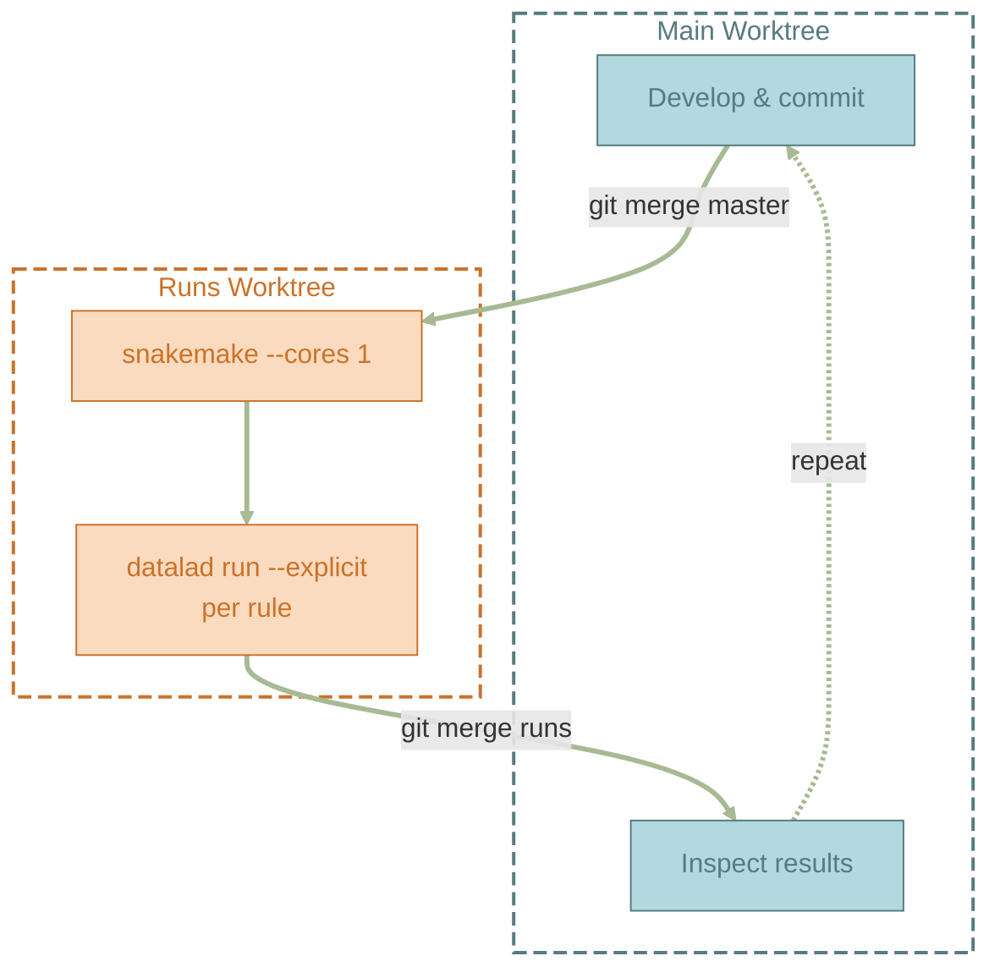

### **Previously on worktrees...**

In the [previous post](),
I introduced a workflow for running `datalad run` commands in a
dedicated git worktree while continuing development in the main worktree.
The batch-processing script was a plain bash loop —
it got the job done, but it had no notion of what had already run,
what was stale, or what depended on what. If the script failed half-way,
a rerun after the fix would either rerun everything again that did not fail, 
or require me to manually comment out job. It also only ran one procedure for 
multiple subjects, but not all procedures for one subject. 

The natural next step:
replace that bash loop with a proper workflow engine.
Enter [Snakemake](https://snakemake.readthedocs.io/).

### **Why Snakemake?**

Snakemake is a workflow management system that thinks in terms of
**rules** and **files**.
Each rule declares its inputs, outputs,
and the shell command that transforms one into the other.
(Sounds familiar? If you've crafted your `datalad run` commands properly, 
then half of the work is already done!)
Snakemake builds a directed acyclic graph (DAG)
of all the rules needed to produce the requested targets,
and then executes only the rules whose outputs are missing
or outdated (i.e. older than inputs).
That last part is key:
**staleness detection is based on file timestamps**.

This is a perfect complement to the `datalad run` command,
which handles provenance tracking of one particular processing step.
Snakemake handles the *orchestration* —
what to run, in what order, and whether it even needs to run at all.
Together they give me:

- **Automatic chaining**:
  Snakemake resolves the dependency graph,
  so I don't need to manually sequence steps 
  (or to remember which steps need a rerun for which subject why ... 
  Seriously, how do people do it?)
- **Incremental execution**:
  Only stale or missing outputs get recomputed
- **Provenance**:
  Every step is a `datalad run` commit
  with full input/output tracking

Here is a simplified view of my pipeline DAG:



Each arrow is a Snakemake rule wrapping a `datalad run` call.
The manual GUI annotation step (warm color)
is the one human-in-the-loop gate in the pipeline.

### **The Snakefile: `datalad run` as shell commands**

A Snakemake rule that wraps `datalad run` looks like this.

```python
SUBJECTS = ["sub-240222M", "sub-240226N", "sub-240226O"]
DRUGS    = ["exp-Saline", "exp-Ketamine", "exp-LSD", "exp-Lisuride"]

rule all:
    input:
        expand(
            "03_fissa/{subject}/{experiment}/plane0/roiset-suite2p/F.npy",
            subject=SUBJECTS,
            experiment=DRUGS,
        ),

# ... more rules

rule fissa:
    input:
        reg_tif  = "01_suite2p/{subject}/{experiment}/plane0/reg_tif",
        allcell  = "01_suite2p/{subject}/{experiment}/plane0/allcell.npy",
        # ... more inputs
        script   = "code/src/process2p/run_fissa.py",
    output:
        F   = "03_fissa/{subject}/{experiment}/plane0/roiset-suite2p/F.npy",
        DFF = "03_fissa/{subject}/{experiment}/plane0/roiset-suite2p/DFF.npy",
        # ... more outputs
    shell:
        """
        datalad run \
            --explicit \
            -m "fissa {wildcards.subject} {wildcards.experiment}" \
            -i "01_suite2p/{wildcards.subject}/{wildcards.experiment}/plane0/reg_tif/*.tif" \
            -i "{input.allcell}" \
            -o "03_fissa/{wildcards.subject}/{wildcards.experiment}/plane0/roiset-suite2p" \
            "./code/src/process2p/run_fissa.py {{inputs}} {{outputs}}"
        """
# ... more rules
```

The `rule all` at the top is a convention —
it doesn't run a command itself,
but lists the final files we want to exist.
`expand()` generates all subject × drug combinations,
and Snakemake works backwards from there:
"to produce this file I need `rule fissa`,
which needs outputs from an earlier rule, which needs..." —
that's how the DAG gets built.
Snakemake's `{wildcards.subject}` and `{wildcards.experiment}`
get expanded at execution time,
producing one `datalad run` invocation
per (subject, experiment) combination.
The `{{inputs}}` and `{{outputs}}` with double braces
are escaped from Snakemake so that `datalad run` sees them
as its own `{inputs}` and `{outputs}` placeholders.

By default, `datalad run` checks that the dataset is clean
before executing.
Snakemake, however,
**removes stale outputs before running a rule** —
that's how it guarantees a fresh build.
This means that by the time `datalad run` executes,
the dataset is already dirty from the deletions.
The fix is `--explicit`:
it tells `datalad run` to only track the files
explicitly listed in `-i` and `-o`,
skipping the global cleanliness check.
To ensure full reproducibility, I recommend running snakemake only
when the state of the dataset is clean and adding a dedicated check
right at the start of the snakefile:
```
# ── Pre-flight: dataset must be clean ─────────────────────────────────────────
# Runs at parse time (before Snakemake removes stale outputs).
_status = subprocess.run(
    ["git", "status", "--porcelain"],
    capture_output=True, text=True,
)
if _status.stdout.strip():
    raise RuntimeError(
        "Dataset is not clean — commit or stash changes before running "
        "snakemake.\n\n  datalad status\n\n" + _status.stdout
    )
```

Apart from this little inconvenience, Snakemake's design of removing staled outputs
turns out to have multiple benefits: 
1. Removing annexed files is instant (just delete the symlink), 
whereas `datalad unlock` on large binary files 
can take a very long time 
because it replaces the symlink with a full copy.
So Snakemake's "delete first, write fresh" approach
is actually *faster* than the unlock-modify-save cycle.
2. Some software intentionally reuses existing outputs to avoid heavy recomputation.
This can be convenient when you are sure that the outputs won't change, but for full reproducibility 
a fresh computation of outputs should be the go-to. 

That said, you can avoid 
the auto-removal of specific outputs simply by not declaring them as outputs 
(skip staleness detection).


### **The Snakemake command: how to call it in a DataLad-aware way**
Once the Snakefile exists (by default as `./Snakefile`, but you can choose your own location
and file name), you can see what Snakemake would execute with a dry run `-n/--dry-run`: 

```bash
< snakemake --cores 1 -n # specify alternative Snakefile with -s <path>
# detailed jobs
# ...

# summary
Job stats:
job                 count
----------------  -------
all                     1
auto_sort              24
create_dataframe       24
fissa                  24
master_iscells         24
total                  97

Reasons:
    (check individual jobs above for details)
    input files updated by another job:
        all, create_dataframe, fissa, master_iscells
    output files have to be generated:
        auto_sort, create_dataframe, fissa, master_iscells
    updated input files:
        auto_sort
This was a dry-run (flag -n). The order of jobs does not reflect the order of execution.
```

There is an important caveat when managing `datalad run` commands with Snakemake.
Snakemake is designed for parallelism —
give it `--cores 8` and it will run independent rules simultaneously.
But with `datalad run`, each rule commits to the git index
and touches the shared `git-annex` branch.
Parallel commits would race and corrupt the repository.
So the pipeline has to run sequentially: `--cores 1`.

This is not a Snakemake limitation
but a DataLad + worktree constraint:
both worktrees share the same `git-annex` branch.
Even so, Snakemake still provides its core value —
staleness detection and automatic chaining —
which is why I'm here in the first place.

### **The timestamp problem: why `git reset --hard` and Snakemake don't mix**

Before Snakemake, I used `datalad foreach-dataset git reset --hard master`
to shuttle changes from the main worktree to the `runs` worktree.
I loved this trick because:

1. **Reset to the future** —
   the worktree has access to all newer commits on `master`
   without fetching,
   because it's a worktree, not a clone
2. **Clean slate** —
   any unwanted changes get wiped in the process

But Snakemake relies on file modification timestamps
to decide what's stale.
Git does not store timestamps —
`git reset --hard` restores file *content*
but sets all timestamps to *now*.
This makes Snakemake think every single file just changed,
which means every rule needs to rerun.
The entire point of incremental execution is lost.

The same principle creates a subtler issue:
if I run a pipeline step in the main worktree
and it produces no new commit
(because the outputs are identical),
the `runs` worktree has no way to know
that step already executed.
Its timestamps were never updated.

The solution is straightforward:
**always run Snakemake in the dedicated worktree,
and use `git merge` instead of `git reset --hard`
to bring in changes from `master`**.
A merge updates file content
without touching timestamps of files that didn't change,
and Snakemake remains correctly informed
about what's fresh and what's stale.


### **The workflow loop**



### **Caveats at a glance**

| Caveat                                 | Cause                                                           | Workaround                             |
|----------------------------------------|-----------------------------------------------------------------|----------------------------------------|
| Sequential execution only              | Worktrees share `git-annex` branch; parallel commits would race | `--cores 1`                            |
| `git reset --hard` destroys timestamps | Git doesn't store mtimes; Snakemake needs them for staleness    | Use `git merge` instead                |
| Always run Snakemake in the worktree   | Timestamps are per-worktree, not per-commit                     | Don't mix execution locations          |
| Dirty working tree upon `datalad run`  | Snakemake deletes stale outputs before running                  | `--explicit` + pre-flight status check |

Happy automating! :snake:
